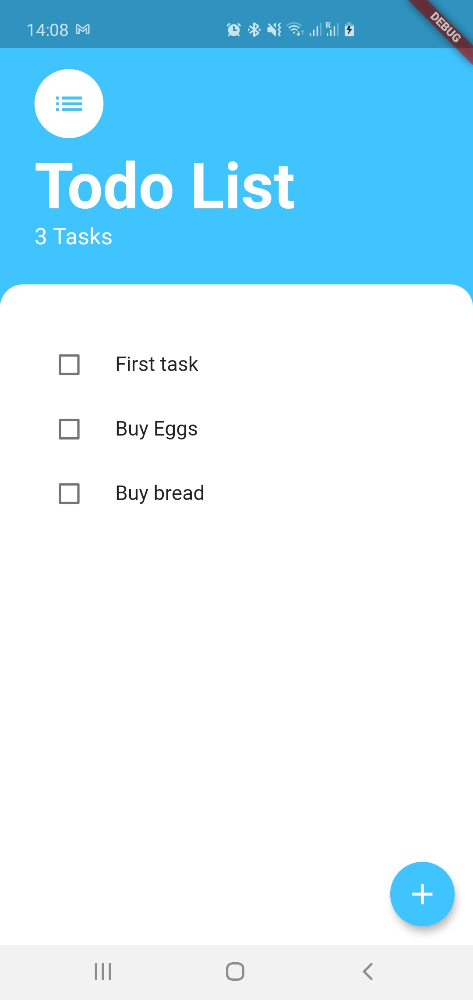
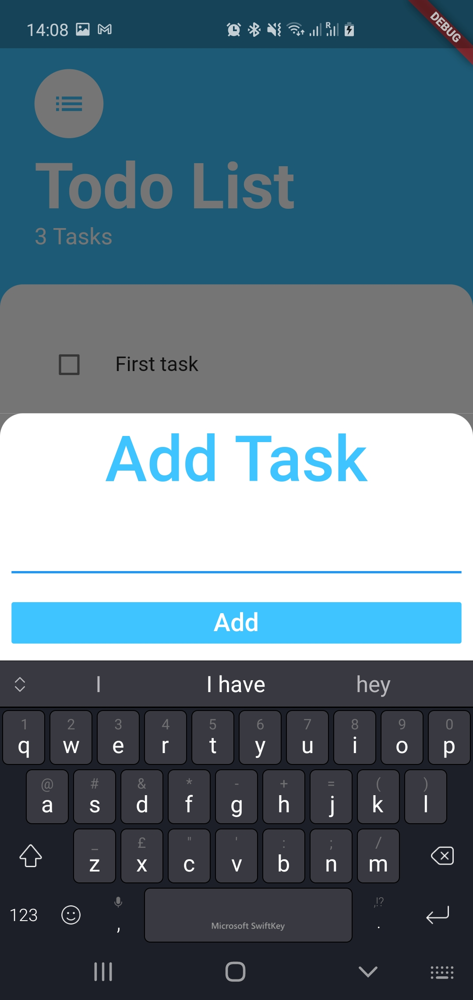

# Todo-List-Flutter-

Video:
 

# How to Run the APP
1. Install flutter from here
https://flutter.dev/docs/get-started/install
2. Optionally you can Install Android Studio from
https://developer.android.com/studio?gclid=CjwKCAiA2O39BRBjEiwApB2IklUot2wKA2863SbV3BOxu44idrakcjggZIq-dmIz9_PA4jDQnosbmhoCgx8QAvD_BwE&gclsrc=aw.ds
3. Clone/Download the code repo and extract it
4. Following this link to create your keys to sign the application
https://flutter.dev/docs/deployment/android
5. Goto to the root folder of the code and type:
    flutter build apk for Android
    or flutter build ios for ios
    
### NOTE: If you ge error flutter command not found then include flutter in your PATH environmental variable
## Install an APK on a device
Follow these steps to install the APK on a connected Android device.

From the command line:

Connect your Android device to your computer with a USB cable.
Enter cd <app dir> where <app dir> is your application directory.
Run flutter install.

## Features of the APP:
1. Add task
2. Remove Task
3. Check off the task

 

 

